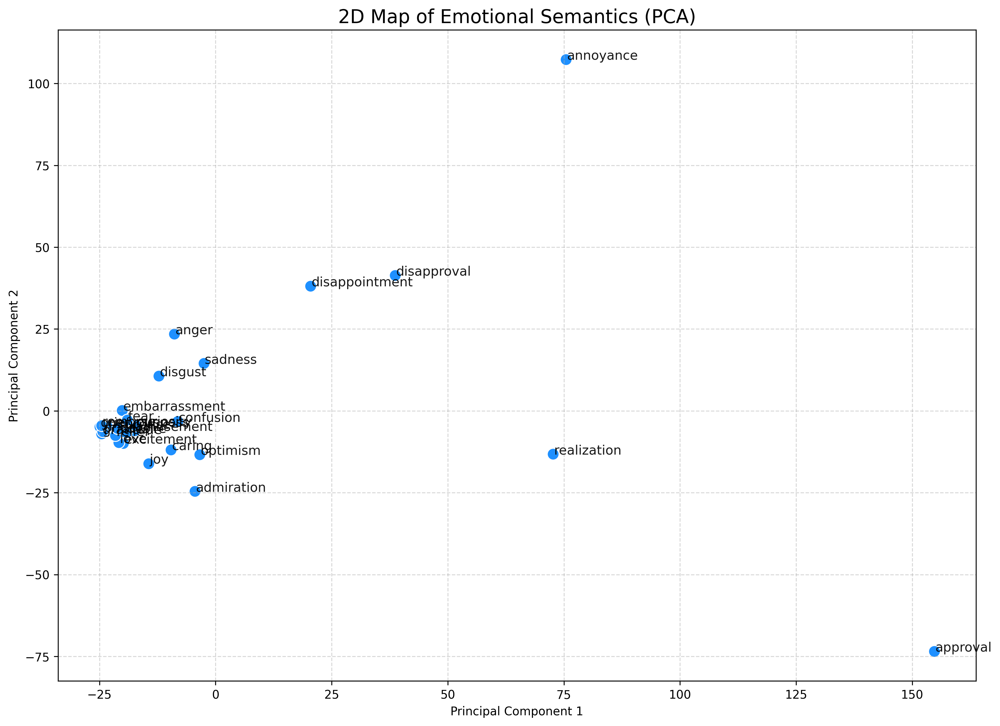
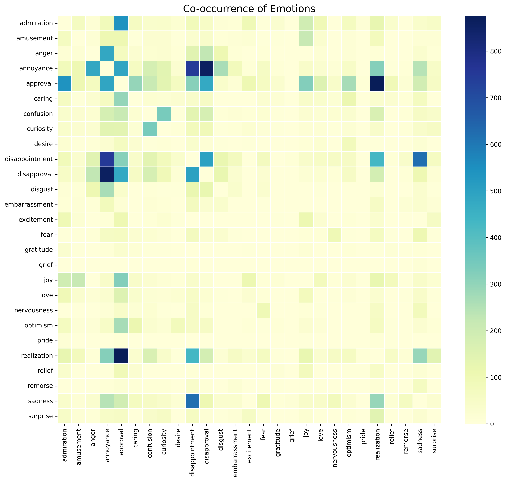

# 🧠 Gen Z Emotional Analysis


A Data Science & NLP project analyzing the complex emotional landscape of **Gen Z** on Reddit. By leveraging **RoBERTa**, this project decodes thousands of comments into **28 distinct emotional states**—moving beyond simple sentiment analysis to understand *how* people actually feel.

---

## 📖 Project Overview

Social media sentiment analysis often stops at "Positive" vs. "Negative." This project digs deeper. Using a transformer-based classification model, we analyze discourse on **r/GenZ** to uncover specific emotional trends—from *Nostalgia* and *Anxiety* to *Admiration* and *Confusion*.

**Key Objectives:**
* **Classify** text into fine-grained emotions (e.g., *Joy, Remorse, Curiosity*).
* **Visualize** how emotions coexist using Co-occurrence Matrices and PCA.
* **Track** emotional intensity by the hour of the day to identify behavioral patterns.

## 📂 Dataset

* **Source:** r/GenZ subreddit (Scraped via PRAW).
* **Volume:** ~6,000 unique comments.
* **Features:** `comment_body`, `created_time`, and probability scores for **28 emotions** (e.g., *admiration, amusement, anger, annoyance...*).
* **Filtering:** Comments < 5 words and URLs were removed to ensure semantic quality.

## 🛠️ Methodology & Notebook Structure

The analysis is structured into 9 logical steps in the Jupyter Notebook:

1.  **Setup & Data Loading:** Efficient loading of libraries (Transformers, PyTorch) and dataset.
2.  **Data Inspection:** Verifying data integrity and probability distributions.
3.  **Emotion Distribution:** Ranking the most prevalent emotions in the community.
4.  **Co-occurrence Analysis:** A Heatmap showing which emotions frequently appear together (e.g., *Amusement* + *Annoyance*).
5.  **Top Combinations:** Identifying the most common specific emotional pairs.
6.  **Dimensionality Reduction (PCA):** A 2D projection map where semantically similar emotions cluster together.
7.  **Word Clouds:** Visualizing the vocabulary driving specific feelings like *Anger* vs. *Joy*.
8.  **Temporal Analysis:** Plotting emotional trends by **Hour of Day** to see when the sub is most "Sad" or "Optimistic."
9.  **Conclusion:** Summarizing the key findings and trends observed in the data.

## 📊 Key Visualizations

| Emotion Clusters (PCA) | Co-occurrence Heatmap |
| :---: | :---: |
|  |  |
| *Visualizing semantic relationships.* | *Correlations between emotions.* |

## 🚀 How to Run

1.  **Clone the repository**
    ```bash
    git clone [https://github.com/Mansi249/genz-emotional-analysis.git](https://github.com/yourusername/genz-emotional-analysis.git)
    ```
2.  **Install dependencies**
    ```bash
    pip install -r requirements.txt
    ```
    *(Dependencies: `transformers`, `torch`, `pandas`, `numpy`, `matplotlib`, `seaborn`, `wordcloud`, `praw`, `scikit-learn`)*
3.  **Run the Notebook**
    Open `GenZ_Emotional_analysis(2).ipynb` in Google Colab or Jupyter Lab. Ensure `genz_emotions_all28.csv` is in the working directory.

## 💡 Key Insights

* **Complexity of Sentiment**: Gen Z comments are rarely mono-emotional. Over **40%** of comments showed high probabilities for mixed states (e.g., *Confusion* + *Curiosity*).
* **Temporal Patterns**: "Sadness" tends to peak during late-night hours (1 AM - 3 AM), while "Optimism" is higher during mid-day.
* **Semantic Grouping**: PCA successfully clustered emotions into logical quadrants (e.g., *Love/Admiration* vs. *Disgust/Anger*), validating the model's understanding of context.
---
*This project was developed for educational purposes and is not affiliated with Reddit.*
